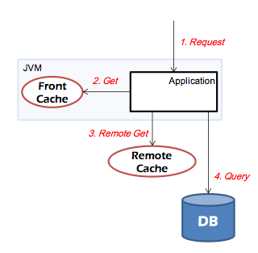

# Arcus Java Client

- [Arcus Client 기본 사용법](02-arcus-java-client.md#arcus-client-%EA%B8%B0%EB%B3%B8-%EC%82%AC%EC%9A%A9%EB%B2%95) 
- [Arcus Client 생성, 소멸, 관리](02-arcus-java-client.md#arcus-client-%EC%83%9D%EC%84%B1-%EC%86%8C%EB%A9%B8-%EA%B4%80%EB%A6%AC) 
- [Arcus Client 설정](02-arcus-java-client.md#arcus-client-%EC%84%A4%EC%A0%95)


## Arcus Client 기본 사용법

예제를 통해 Arcus java client 기본 사용법을 알아본다.
아래 예제는 Arcus cache에 key가 “sample:testKey”이고 value가 “testValue”인 cache item을 저장한다.

```java
package com.navercorp.arcus.example; 

import java.util.concurrent.ExecutionException; 
import java.util.concurrent.Future; 
import java.util.concurrent.TimeUnit; 
import java.util.concurrent.TimeoutException; 
import net.spy.memcached.ArcusClient; 
import net.spy.memcached.ConnectionFactoryBuilder; 

public class HelloArcus { 

    private static final String ARCUS_ADMIN = "10.0.0.1:2181,10.0.0.2:2181,10.0.0.3:2181"; 
    private static final String SERVICE_CODE = "test"; 
    private final ArcusClient arcusClient; 

    public static void main(String[] args) { 
        HelloArcus hello = new HelloArcus(); 
        System.out.printf("hello.setTest() result=%b", hello.setTest()); 
        hello.closeArcusConnection(); 
    } 

    public HelloArcus() { 
        arcusClient = ArcusClient.createArcusClient(ARCUS_ADMIN, SERVICE_CODE, 
                new ConnectionFactoryBuilder()); // (1) 
    } 

    public boolean setTest() { 
        Future<Boolean> future = null; 
        try { 
            future = arcusClient.set("sample:testKey", 10, "testValue"); // (2) 
        } catch (IllegalStateException e) { 
            // client operation queue 문제로 요청이 등록되지 않았을 때 예외처리. 
        } 

        if (future == null) return false; 

        try { 
            return future.get(500L, TimeUnit.MILLISECONDS); // (3) 
        } catch (TimeoutException te) { // (4) 
            future.cancel(true); 
        } catch (ExecutionException re) { // (5) 
            future.cancel(true); 
        } catch (InterruptedException ie) { // (6) 
            future.cancel(true); 
        } 

        return false; 
    } 

    public void closeArcusConnection() { 
        arcusClient.shutdown(); // (7) 
    } 
} 
```

(1) ArcusClient 클래스의 객체(client 객체)를 생성한다. Client 객체는 매 요청마다 생성하지 않고
    미리 하나를 만들어 재활용하도록 한다.
    Arcus에 접속할 때, 각종 설정을 변경하기 위해서 ConnectionFactoryBuilder를 사용하였다. 

- **잘못된 SERVICE_CODE를 지정했다면 NotExistsServiceCodeException이 발생한다.**
- **SERVICE_CODE는 올바르지만 접속 가능한 cache 서버(또는 노드)가 없다면, 모든 요청은 Exception을 발생시킨다.**
  **Cache 서버가 구동되어 접속이 가능해지면, 자동으로 해당 cache 서버로 연결하여 정상 서비스하게 된다.**

(2) Client 객체의 `set` 메소드를 호출하고 그 결과를 Boolean 값을 갖는 Future 클래스의 객체(future 객체)로 받는다.

- 저장할 값으로 ""(길이가 0인 문자열)을 넣으면, ""이 그대로 저장된다. (해당 key가 삭제되지 않는다.)
- 저장할 값으로 null을 지정할 수 없다. (key 삭제 의도이면, `delete` 메소드를 사용해야 한다.)
- 저장할 값은 serializable해야 한다. (사용자 정의 클래스의 경우 Serializable 인터페이스를 구현해야 한다.)

(3) Future 객체의 값을 받아서 result에 담는다. (만약 set 작업이 실패하였을 경우에는 false가 반환된다.)

- Cache 서버에 key가 존재하지 않는다면, 다시 말해 cache miss이라면, null이 반환된다.
- 길이가 0인 문자열(“”)은 cache miss가 아니고 “”가 저장되어 있는 것이다.

(4) 지정한 시간에 결과가 넘어 오지 않거나 JVM의 과부하로 operation queue에서 처리되지 않을 경우
    TimeoutException이 발생한다.

- 예를 들어, timeout 시간을 500ms로 지정했는데 GC time이 600ms걸렸다면
  Arcus cache 서버와 통신에 문제가 없음에도 불구하고 100ms를 초과했기 때문에 TimeoutException이 발생하게 된다.
- TimeoutException이 연속해서 n(디폴트는 10)회 이상 발생하면 클라이언트는 서버와의 연결을 끊고 재접속한다.
  여기에서 n번의 값은 ConnectionFactoryBuilder를 생성할 때 지정할 수 있다. 
- 또한, 모든 Exception이 발생한 상황에서는 future.cancel(true)를 반드시 호출해 주어야 한다.

(5) ArcusClient의 operation queue에 대기하고 있던 작업이 취소되었을 때, ExecutionException이 발생한다.
    ExecutionException은 서버 또는 네트워크 장애 시 발생한다.

(6) 다른 쓰레드에서 해당 쓰레드의 작업을 Interrupt했을 때 InterruptedException이 발생한다. (발생할 여지가 거의 없다.)

(7) 프로세스를 종료하기 전에 더 이상 ArcusClient를 사용하지 않으므로,
    반드시 `shutdown` 메소드를 호출하여 서버와의 연결을 끊어야 한다.

- Tomcat과 같은 WAS에서는 Tomcat이 shutdown이 될 때 `shutdown` 메소드가 호출되게 하면 된다.
- Spring container에서 관리되는 경우 bean 설정의 destroy-method에서 `shutdown` 메소드가 호출되도록 설정해야 한다.


## Arcus Client 생성, 소멸, 관리

### Arcus Client 생성

하나의 Arcus Client 객체는 Arcus cache cloud에 있는 모든 cache server(or cache node)와 연결을 하나씩 생성하며,
요청되는 각 cache item의 key에 대해 그 key가 mapping되는 cache server와의 연결을 이용하여 request를 보내고
response를 받는다.

Arcus Client 객체를 생성하는 방법으로 두 가지가 있다.

- 단일 Arcus Client 생성
- Arcus Client Pool 생성

먼저, 단일 Arcus Client 객체를 생성하기 위한 메소드는 아래와 같다.

```java
ArcusClient.createArcusClient(String arcusAdminAddress, String serviceCode, ConnectionFactoryBuilder cfb)
```

- arcusAdminAddress: 접근할 cache cloud를 관리하는 Arcus zookeeper ensemble 주소
  - IP:port 리스트인 "ip1:port,ip2:port,ip3:port" 형태로 지정하거나
  - "FQDN:port" 형태로 지정할 수 있다. (zookeeper IP list에 대한 domain name을 DNS에 등록한 경우)
- serviceCode: 접속할 cache cloud의 식별자
- cfb: Arcus client의 동작 설정을 위한 ConnectionFactoryBuilder 객체


ARCUS_ADMIN 서버에서 관리되는 SERVICE_CODE에 해당하는 cache cloud로 연결하는 하나의 ArcusClient 객체를
생성하는 예는 아래와 같다.

```java
ConnectionFactoryBuilder cfb = new ConnectionFactoryBuilder();
ArcusClient client = ArcusClient.createArcusClient(ARCUS_ADMIN, SERVICE_CODE, cfb);
```

하나의 Arcus Client만으로는 응용의 requests를 처리하는 용량 즉, throughput에 한계가 있다.
예를 들어, 하나의 연결을 통해 하나의 request가 처리되는 시간이 1ms라 가정하면,
그 연결을 통해 최대 1000 requests/second 밖에 처리할 수 없다.
따라서, 많은 요청 처리량이 필요한 응용인 경우는 다수의 Arcus client 객체를 생성하여야 한다.
이를 위해 Arcus client pool 객체를 생성할 수 있으며, 아래의 메소드를 사용해 생성한다.

```java
ArcusClient.createArcusClientPool(String arcusAdminAddress, String serviceCode, ConnectionFactoryBuilder cfb, int poolSize);
```

메소드의 인자로 단일 Arcus client 객체를 생성할 시의 인자들 외에
pool에 들어갈 arcus client 객체 수를 지정하는 poolSize 인자가 있다.
pool size가 너무 작으면 응용 요청들을 제시간에 처리할 수 없는 문제가 생기고,
너무 크면 arcus cache server로 불필요하게 많은 연결을 맺게 한다.
적절한 pool size는 "응용 서버의 peak arcus request 요청량"을 "하나의 arcus client의 처리량"으로 나누면 
얻을 수 있다. 여기서, 하나의 arcus client가 처리할 수 있는 처리량은
응용 서버가 요청하는 arcus request 유형과 응용 서버와 cache server 간의 네트웍 상태 등에 영향받을 수 있으므로,
실제 테스트를 통해 확인해 보고 pool size를 결정하길 권한다.

특정 SERVICE_CODE에 해당하는 cache cloud로 연결되는 Arcus client 4 개를 가지는 pool을 생성하는 예는 
다음과 같다.

```java
int poolSize = 4;
ConnectionFactoryBuilder cfb = new ConnectionFactoryBuilder();
ArcusClientPool pool = ArcusClient.createArcusClientPool(ARCUS_ADMIN, SERVICE_CODE, cfb, poolSize);
```

Arcus client 객체를 정상적으로 생성하면, 아래의 로그와 같이 cache cloud와 정상 연결됨을 볼 수 있다.

```
WARN net.spy.memcached.CacheManager: All arcus connections are established.
```

Arcus cache cloud로 정상 연결되지 않으면, 다음과 같은 로그가 보인다.
예를 들어 5대의 Cache server에 접속을 해야 하는데 이들 중 일부 서버에 접속하지 못했다면 아래 로그가 남게 된다.
접속 실패한 cache server에 대해서는 Arcus client가 1초에 한 번씩 자동으로 재연결을 시도한다.

```
WARN net.spy.memcached.CacheManager: Some arcus connections are not established.
```

### Arcus Client 소멸

ArcusClient 또는 ArcusClientPool를 사용하고 난 다음에는
반드시 shutdown() 메소드를 호출하여 client와 admin, cache server간의 연결을 해제시켜주어야 한다.

```java
client.shutdown();
pool.shutdown();
```

#### Arcus Client 생명주기 관리

Arcus에 대한 매 요청마다 arcus client 객체를 생성하고 소멸시키는 것은 적절하지 못하다.
응용 서버의 구동 시에 arcus client 객체를 생성하고, 종료 시에 arcus client 객체를 소멸하면 된다.

일반적으로, 응용에서는 ArcusClient wrapper를 만들어 사용할 것을 권장한다.
이렇게 하면 ArcusClient의 생명주기를 관리하기 수월해진다.
Service code별 ArcusClient instance를 가지는 factory를 singleton으로 만들어두고
WAS가 초기화 될 때 Arcus server 와 연결을 맺도록 하자.
WAS가 shutdown될 때 ArcusClient도 함께 shutdown되도록 설정하면 가장 이상적이다.


#### Cache Server List 관리

Arcus는 cache server list를 자동으로 관리한다. 
Cache server들 중에 일부 서버가 사용 불가능한 상태가 되면
Arcus admin이 자동으로 상황을 인지하고 해당 서버를 cache server list에서 제거하며,
변경된 cache server list가 있음을 각 arcus client에 알림으로써
각 arcus client가 최신의 cache server list를 유지하게 한다.
반대로 사용 가능한 cache server가 추가되었을 때에도 마찬가지로,
Arcus admin의 도움으로 Arcus client는 최신의 cache server list를 유지하고,
cache key와 cache server와의 mapping을 갱신하게 한다.
따라서, Arcus client를 사용할 때 cache server 대수의 변화에 대한 방어 로직은 신경 쓰지 않아도 된다.


## Arcus Client 설정

### Key-Value에서 데이터 압축 설정

Arcus client는 key-value item의 데이터 압축 및 해제 기능을 가지고 있다.
즉, 일정 크기 이상의 데이터이면 그 데이터를 압축하여 cache server에 보내어 저장하고,
cache server로 부터 가져온 데이터가 압축 데이터이면, 해제하여 응용에 전달한다.

Arcus client는 저정할 값의 크기가 16KB 이상일 경우에 압축하여 cache server에 저장하도록 되어 있다.
이러한 데이터 압축 임계값은 ConnectionFactoryBuilder의 setTranscoder메소드를 통해 설정할 수 있다.

다음은 4KB 이상의 데이터는 모두 압축하도록 설정하는 예제이다.

```java
ConnectionFactoryBuilder cfb = new ConnectionFactoryBuilder();

SerializingTranscoder trans = new SerializingTranscoder();
trans.setCharset(“UTF-8”);
trans.setCompressionThreshold(4096);

cfb.setTranscoder(trans);

ArcusClient client = ArcusClient.createArcusClient(SERVICE_CODE, cfb);
```

### Logger 설정

Arcus client 사용 시에 default(DefaultLogger), log4j(Log4JLogger), slf4j(SLF4JLogger), jdk(SunLogger) 등 4가지 종류의 Logger를 사용할 수 있다.
사용할 logger를 지정하지 않으면 ArcusClient는 DefaultLogger를 기본으로 사용하며,
DefaultLogger는 INFO level 이상의 로그를 stderr (System.err) 로 출력한다. (변경 불가)

log4j를 사용하여 ArcusClient 로그를 관리하려면, 아래 옵션을 WAS나 자바 프로세스 옵션에 추가하여 JVM 구동시 System property를 지정한다. 

```
-Dnet.spy.log.LoggerImpl=net.spy.memcached.compat.log.Log4JLogger
```

또는, 소스 코드에서 ArcusClient / ArcusClientPool을 사용하기 전에 직접 System property를 설정하여 사용할 수 있다. (programmatic configuration)

```java
System.setProperty("net.spy.log.LoggerImpl", "net.spy.memcached.compat.log.Log4JLogger");
...
ConnectionFactoryBuilder cfb = new ConnectionFactoryBuilder();
ArcusClient client = ArcusClient.createArcusClient(SERVICE_CODE, cfb);
```

Arcus Java client에서는 Log를 기록할 때 Class의 이름(```clazz.getName()```)을 기준으로 Logger를 구분하여 사용하며,
class의 이름과 정확히 일치하는 로거가 없다면 logger tree 상의 상위 logger 를 사용한다.

아래의 예제는 ```root``` logger 의 level을 ```WARN```으로 설정하여 WARN level 이상의 로그는 항상 기록하고, ```net.spy.memcached.protocol.ascii.CollectionUpdateOperationImpl``` class의 로그만 DEBUG level 이상의 로그를 기록하도록 한 예제이다.
```xml
<Root level="WARN">
    <AppenderRef ref="console" />
</Root>
<Logger name="net.spy.memcached.protocol.ascii.CollectionUpdateOperationImpl" additivity="false" level="DEBUG">
    <AppenderRef ref="console" />
</Logger>
```
Application을 디버깅해야 할 때 Arcus client에서 Arcus server로 전송하는 ascii protocol 문자열이 궁금할 때가 있다. Arcus Java Client에서 Arcus server로 전송하는 protocol을 로그로 살펴보려면 아래와 같이 logger를 설정하면 된다.
예제에 나열된 logger를 모두 설정하면 요청(get, set 등..)별로 모든 로그가 남게 되니 필요한 요청에 해당하는 logger만 설정하면 편리하다.
Ascii Protocol에 대한 자세한 내용은 [Arcus 서버 명령 프로토콜](https://github.com/naver/arcus-memcached/blob/master/doc/arcus-ascii-protocol.md) 문서를 참고하기 바란다.
```xml
<!-- collection update -->
<Logger name="net.spy.memcached.protocol.ascii.CollectionUpdateOperationImpl" level="DEBUG" additivity="false">
    <AppenderRef ref="console" />
</Logger>

<!-- collection piped exist -->
<Logger name="net.spy.memcached.protocol.ascii.CollectionPipedExistOperationImpl" level="DEBUG" additivity="false">
    <AppenderRef ref="console" />
</Logger>

<!-- set attributes -->
<Logger name="net.spy.memcached.protocol.ascii.SetAttrOperationImpl" level="DEBUG" additivity="false">
    <AppenderRef ref="console" />
</Logger>

<!-- collection insert -->
<Logger name="net.spy.memcached.protocol.ascii.CollectionInsertOperationImpl" level="DEBUG" additivity="false">
    <AppenderRef ref="console" />
</Logger>

<!-- collection get -->
<Logger name="net.spy.memcached.protocol.ascii.CollectionGetOperationImpl" level="DEBUG" additivity="false">
    <AppenderRef ref="console" />
</Logger>

<!-- collection update -->
<Logger name="net.spy.memcached.protocol.ascii.CollectionUpdateOperationImpl" level="DEBUG" additivity="false">
    <AppenderRef ref="console" />
</Logger>

<!-- collection count -->
<Logger name="net.spy.memcached.protocol.ascii.CollectionCountOperationImpl" level="DEBUG" additivity="false">
    <AppenderRef ref="console" />
</Logger>
```

기타 log4j의 자세한 설정 방법은 [log4j 설정 방법](http://logging.apache.org/log4j/2.x/manual/configuration.html)을 확인하기 바란다. 

### Log4JLogger 사용시 유의사항

log4j 1.2 이하 버전에서 보안 취약점이 존재하여, Arcus client의 1.11.5 버전부터 Log4JLogger를 사용하려면 log4j2 라이브러리가 요구된다. 이를 위해 응용 의존성에 아래와 같이 log4j2 라이브러리를 추가한다.

```xml
<dependency>
    <groupId>org.apache.logging.log4j</groupId>
    <artifactId>log4j-core</artifactId>
    <version>2.8.2</version>
</dependency>
<dependency>
    <groupId>org.apache.logging.log4j</groupId>
    <artifactId>log4j-api</artifactId>
    <version>2.8.2</version>
</dependency>
```

만약 아래와 같은 예외가 발생되면, log4j2 라이브러리가 클래스패스에 존재하지 않은 것이다. log4j2 라이브러리가 응용 의존성에 제대로 추가가 됐는지 확인하도록 한다.

```
Warning:  net.spy.memcached.compat.log.Log4JLogger not found while initializing net.spy.compat.log.LoggerFactory
java.lang.NoClassDefFoundError: org/apache/logging/log4j/spi/ExtendedLogger
    at java.base/java.lang.Class.forName0(Native Method)
    at java.base/java.lang.Class.forName(Class.java:315)
    at net.spy.memcached.compat.log.LoggerFactory.getConstructor(LoggerFactory.java:134)
    at net.spy.memcached.compat.log.LoggerFactory.getNewInstance(LoggerFactory.java:119)
    at net.spy.memcached.compat.log.LoggerFactory.internalGetLogger(LoggerFactory.java:100)
    at net.spy.memcached.compat.log.LoggerFactory.getLogger(LoggerFactory.java:89)
    at net.spy.memcached.ArcusClient.<clinit>(ArcusClient.java:183)
    at Main.main(Main.java:10)
```

### SLF4JLogger 사용시 유의 사항

slf4j를 사용하는 경우, Arcus client의 SLF4JLogger 클래스를 사용할 것이다. 이 클래스를 사용하려면 slf4j를 구현한 로깅 라이브러리가 응용 의존성에 추가되어야 한다. 만약 추가하지 않을 경우 아래의 예외 메시지가 발생한다.

```
SLF4J: Failed to load class "org.slf4j.impl.StaticLoggerBinder".
SLF4J: Defaulting to no-operation (NOP) logger implementation
SLF4J: See http://www.slf4j.org/codes.html#StaticLoggerBinder for further details.
```

log4j, logback과 같은 대표적인 자바의 로그 라이브러리들은 slf4j api를 구현한 구현 라이브러리를 제공하고 있다. 해당 라이브러리를 사용할 경우 아래와 같이 응용 의존성에 추가하도록 한다. 자세한 내용은 [slf4j](http://www.slf4j.org/manual.html#swapping) 문서를 참고한다. 

```xml
<!-- slf4j + log4j 사용시 -->
<dependency>
    <groupId>com.navercorp.arcus</groupId>
    <artifactId>arcus-java-client</artifactId>
    <version>${arcus-java-client.version}</version>
</dependency>
<dependency>
    <groupId>org.apache.logging.log4j</groupId>
    <artifactId>log4j-core</artifactId>
    <version>${log4j.version}</version>
</dependency>
<dependency>
    <groupId>org.apache.logging.log4j</groupId>
    <artifactId>log4j-api</artifactId>
    <version>${log4j.version}</version>
</dependency>
<dependency>
    <groupId>org.apache.logging.log4j</groupId>
    <artifactId>log4j-slf4j-impl</artifactId>
    <version>${log4j.version}</version>
</dependency>
```

```xml
<!-- slf4j + logback 사용시 -->
<dependency>
    <groupId>com.navercorp.arcus</groupId>
    <artifactId>arcus-java-client</artifactId>
    <version>${arcus-java-client.version}</version>
</dependency>
<dependency>
    <groupId>ch.qos.logback</groupId>
    <artifactId>logback-classic</artifactId>
    <version>${logback.version}</version>
</dependency>
<dependency>
    <groupId>ch.qos.logback</groupId>
    <artifactId>logback-core</artifactId>
    <version>${logback.version}</version>
</dependency>
```

또한 2개 이상의 slf4j의 구현 라이브러리(log4j-slf4j-impl, logback-classic, ...)들이 같은 클래스패스에 존재할 경우, SLF4J에서 [multiple binding error](http://www.slf4j.org/codes.html#multiple_bindings)가 발생하므로 반드시 exclusion 키워드를 이용해 slf4j 구현 라이브러리가 하나만 존재하도록 하여야 한다.

```
SLF4J: Class path contains multiple SLF4J bindings.
SLF4J: See http://www.slf4j.org/codes.html#multiple_bindings for an explanation.
```

### Transparent Front Cache 사용

Arcus는 기본적으로 원격 Cache 시스템이므로 요청에 대한 응답을 받을 때마다 데이터를 객체화해야 하는 단점이 있다.
이는 결국 JVM의 Garbage Collector에 부담으로 작용할 것이다.
따라서 만약 실제 데이터가 거의 변경되지 않고, 변경이 있더라도 아주 짧은 시간 내에는 이전 데이터를 보여줘도 상관없는 경우라면 Front Cache를 사용할 것을 고려해 볼 만 하다.

Front cache를 이용하려면 Remote Cache에서 Hit가 되었을 경우 별도로 Front Cache 저장소에 기록을 해 주어야 하는데,
코드가 상당히 지저분해 지는 경향이 있다. 그리고 데이터를 가져올 때도 아래 그림에 나온 것처럼 제일 먼저 Front Cache를 확인하고 다음에 Remote Cache를 확인한다면 이 또한 프로그램이 복잡해져 버린다. 





따라서 Transparent하게 즉, 라이브러리에서 알아서 Front Cache를 활성화하여 JVM에서 일정 시간 Item을 보관해 줄 수 있다면 편리하면서도 보다 빠른 응용을 개발할 수 있을 것이다. Arcus에는 Ehcache라는 Local cache 플러그인이 추가되어 복잡한 프로그램 작업 없이 바로 Front cache를 사용할 수 있도록 되어 있다. 사용자는 간단한 옵션만 설정하면 2번과 3번 작업은 라이브러리 내에서 자동으로 수행한다.

다음은 Front cache를 사용을 위한 메소드로 ConnectionFactoryBuilder 클래스를 생성할 때 적용한다.

- `setMaxFrontCacheElements(int to)` (Required)

  여기에 적용되는 값은 Front Cache에서 사용할 최대 Item수를 의미한다.
  기본값은 0인데, 0이면 Front Cache를 사용하지 않는다는 뜻이다.
  따라서 Front Cache를 사용하기 위해서는 반드시 양의 정수값을 지정해야 한다.
  만약 최대 Item 수를 초과하면 LRU 알고리즘을 통해 가장 사용되지 않는 Item을 제거하고 새로운 Item을 등록하게 된다.

- `setFrontCacheExpireTime(int to)` (Optional, default 5)

  Front Cache item의 expire time이다.
  Front cache는 item별 expire time을 설정하지 않고, 등록된 모든 item에 동일한 expire time이 적용된다.
  기본값은 5이며 단위는 second이다.
  설정하지 않는다면 기본값을 그대로 사용한다면 등록된 지 5초가 지나면 자동으로 사라지게 된다. 

- `setFrontCacheCopyOnRead(boolean copyOnRead)` (Optional, default false)
  
  Front Cache 에서 Copy Cache 기능의 copy on read 옵션을 활성화시키기 위한 설정이며, 기본값은 false 이다.

- `setFrontCacheCopyOnWrite(boolean copyOnWrite)` (Optional, default false)

  Front Cache 에서 Copy Cache 기능의 copy on write 옵션을 활성화시키기 위한 설정이며, 기본값은 false 이다.

  EhCache 의 Copy Cache 기능에 대해서는 다음 [문서](http://www.ehcache.org/documentation/2.8/get-started/getting-started.html)를 참조 바람.

Front cache 사용 상의 주의 사항은 다음과 같다.

- Transparent Front Cache는 현재 Key-Value get/set에 대해서만 적용 가능하다.
- Front cache는 remote Arcus와 sync를 맞추지 않기 때문에 주로 read-only data를 caching하는데 적합하다.
  그리고 front caching expire time도 remote cache entry update주기에 따라 sync가 맞지 않는 기간을 잘 파악하여
  설정해야 한다.
- Front Cache 데이터는 flush 명령어를 통해서 flush 되지 않는다

아래는 Front cache를 사용하기 위한 코드이다.
setMaxFrontCacheElements만 0보다 큰 값으로 설정하면 Front Cache가 활성화된다. (setFrontCacheExpireTime 도 사용 용도에 맞도록 명시적인 값을 설정해 주는 것을 추천함)

```java
ConnectionFactoryBuilder factory = new ConnectionFactoryBuilder();

/* Required to use transparent front cache */
factory.setMaxFrontCacheElements(10000);

/* Optional settings */
factory.setFrontCacheExpireTime(5);
factory.setFrontCacheCopyOnRead(true);
factory.setFrontCacheCopyOnRead(true);

ArcusClient client = new ArcusClient(SERVICE_CODE, factory);
```

응용에서 Arcus에 대해 front cache를 사용해야 부분과 사용하지 않아야 하는 부분으로 구분된다면,
각 용도에 맞는 Arcus client 객체를 별도로 생성하여 사용하여야 한다.


### ConnectionFactoryBuilder 클래스의 주요 메소드

- setFailureMode(FailureMode fm)

  FailureMode를 변경한다.
  Cancel, Redistrubute, Retry의 3개 FailureMode가 있으며, 각각의 의미는 다음과 같다.

  - Cancel : 다운(down)된 노드에 요청하는 모든 작업을 자동으로 취소한다.
  - Redistribute : 여러 개의 Node가 등록되어 있을 경우, Request가 실패하면 다음 Node에게 해당 Request를 다시 요청한다.                      이렇게 해서 Timeout이 날 때까지 수행한다. 만약 Node가 한 개라면 다음 Node는 자기 자신이 된다.
  - Retry : Timeout이 날 때까지 Request가 실패하면 계속 현재 Node에 요청을 시도한다

  Arcus는 Cancel 모드를 디폴트로 사용한다.
  Redistribute나 Retry를 사용할 경우, 반복적인 요청에 의해 응용 서버에 부하가 발생할 수 있어
  이러한 두 가지 방식의 사용을 금지하고 있다.
  
- setOpTimeout(long t)

  SpyThread가 Arcus Cache Server로부터 응답을 받는 동안의 오퍼레이션 타임아웃을 밀리초 단위로 설정한다.
  기본값은 1,000 밀리초이다.
  참고로, 응용이 Callback을 받을 때까지 설정하는 Timeout은
  “오퍼레이션 타임아웃 + 명령어 생성시간 + 명령어 등록시간”을 포함하는 Timeout으로 이것과는 다르다.

- setProtocol(ConnectionFactoryBuilder.Protocol prot)

  Arcus client와 server 사이에 사용할 프로토콜을 지정한다.
  Text와 Binary의 두 프로토콜이 있으나, **Arcus에서는 Text 프로토콜만을 사용해야 한다.**
  
- setMaxReconnectDelay(long to)

  Arcus와 연결이 끊겼을 경우 다시 연결을 맺기 위해서 대기하는 최대 시간을 초 단위로 지정한다.
  Arcus는 기본 1초를 사용한다.

- setOpQueueFactory(OperationQueueFactory q)

  명령어의 내용을 담는 operation 큐를 생성한다. 기본적으로 크기가 16,384인 큐를 사용한다.
  큐의 크기를 1000으로 변경하고 싶다면 setOpQueueFactory(new ArrayOperationQueueFactory(1000))으로 설정하면 된다.

- setTranscoder(Transcoder<Object> t)

  캐시의 데이터 영역에 대한 character set과 압축 기준을 설정한다.
  GZip 압축을 사용하며, 기본값은 UTF-8과 16,384 byte이다.
  즉, 모든 요청의 data 영역은 UTF-8로 encoding/decoding 되고 data 영역의 크기가 16,384byte 이상이면
  압축하여 Arcus와 통신하게 된다.
  
  만약, character set을 EUC-KR로 설정하고 압축 기준을 4,096byte로 변경하려면 다음과 같이 설정한다.

  ```java
  SerializingTranscoder trans = new SerializingTranscoder();
  trans.setCharset(“EUC-KR”);
  trans.setCompressionThreshold(4096);
  setTranscoder(trans);
  ```

- setShouldOptimize(boolean o)

  최적화 로직 사용여부를 결정한다.
  최적화 로직은 Operation Queue에 순서대로 있는 get 연산들을  multi-get과 get 연산으로 조합형으로
  한꺼번에 수행하게 된다. **Arcus에서는 optimize 로직 사용을 권장하지 않는다.**

- setReadBufferSize(int to)

  Arcus server socket과 통신할 때 사용되는 전역 ByteBuffer 크기를 설정한다.
  (이름은 Read이지만 읽기/쓰기 버퍼의 크기는 이 값을 따른다)
  만약 ByteBuffer 크기를 넘어서는 데이터가 넘어오면 재 사용성을 높이기 위해 ByteBuffer 크기만큼 처리한 후
  ByteBuffer의 내용을 비우고, 다시 사용하도록 되어 있다. 크기의 단위는 byte이며, 기본값은 16,384이다.
  
- setDaemon(boolean d)

  기본값이 true이다. 

- setTimeoutExceptionThreshold(int to)

  Timeout이 연속으로 발생할 경우 해당 Connection에 문제가 발생했다고 판단하여 Connection을 끊고 재접속을 시도한다.
  Arcus에서 사용하는 연속 Timeout 한계값은 10이다.

- setTimeoutRatioThreshold(int to)

  Client request가 어떤 이유로 오랫동안 처리되지 못하면, Arcus client는 continuous timeout 방법으로
  이를 탐지하고 응용에게 빠른 실패 응답을 전달한다. 따라서, 응용은 실패한 request 성격에 따라
  DB 조회할 지 아니면 Arcus에 재요청할 지를 결정하여 움직일 수 있다.

  Client request가 오랫동안 처리되지 못하는 것이 아닌 그 처리 속도가 매우 느려진 경우에는
  일부 request에 대해 operation timeout이 발생하지만 다른 일부 requests는 정상 처리될 수 있다.
  이 경우, client request가 정상 처리되 않지만 continuous timeout이 발생하지 않을 수 있다.
  이러한 상태를 탐지하기 위하여, 최근 100개 requests에 대해 timeout ratio를 계산하여 
  특정 threshold 이상이면 현재 connection을 끊고 재접속을 시도하는 기능이다.
  
  Timeout ratio threshold의 default 값은 0으로 disabled된 상태이며,
  1 ~ 99 사이의 값을 주면 그 값으로 timeout ratio threshold가 설정되어 동작하게 된다.

- setOpQueueMaxBlockTime(long t)

  Operation을 요청할 때 비동기식으로 Operation queue에 등록하여 작업을 요청하게 되어 있는데,
  이 옵션은 Queue가 모두 꽉 찬 상태가 되었을 때 최대 기다리는 시간을 의미한다.
  단위는 millisecond 이고, 기본값은 10000ms이다.
